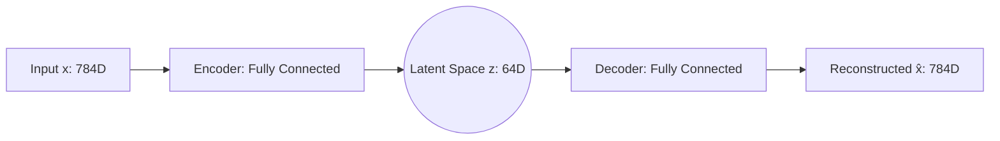
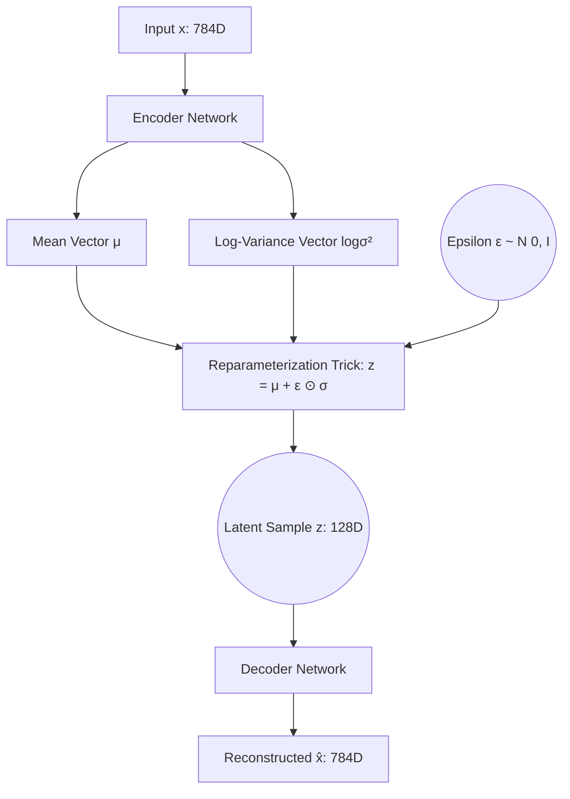

# Unsupervised & Generative Learning: Autoencoders and VAEs

This repository contains clean, well-documented PyTorch implementations of **Standard Autoencoders (AE)** and **Variational Autoencoders (VAE)**. These models are trained on classic image datasets (FashionMNIST and MNIST) to demonstrate dimensionality reduction, latent space representation learning, and generative sampling.

---

## 📂 Project Structure

```directory
├── AutoEncoder/
│   ├── AutoEncoders.ipynb    # Standard Autoencoder implementation on FashionMNIST
│   └── data/                 # Downloaded FashionMNIST dataset
├── VAE/
│   └── VAE_scratch.ipynb     # Variational Autoencoder (from scratch) on MNIST
└── README.md                 # Project overview and documentation (this file)
```

---

## 🧠 Theory and Architecture

### 1. Standard Autoencoder (AE)
A standard Autoencoder is a neural network designed to learn efficient codings of input data in an unsupervised manner. It compresses the input into a low-dimensional bottleneck (latent space) and then reconstructs the original input from this representation.



* **Encoder**: Maps input $x$ to latent representation $z$:
  $$z = f(W_e x + b_e)$$
* **Decoder**: Maps latent representation $z$ to reconstruction $\hat{x}$:
  $$\hat{x} = g(W_d z + b_d)$$
* **Loss Function**: Mean Squared Error (MSE) loss:
  $$\mathcal{L}_{\text{MSE}}(x, \hat{x}) = \frac{1}{N} \sum_{i=1}^N (x_i - \hat{x}_i)^2$$

---

### 2. Variational Autoencoder (VAE)
A Variational Autoencoder (VAE) is a directed probabilistic graphical model and generative framework. Instead of mapping inputs to deterministic code vectors, it maps inputs to parameters of a probability distribution (mean $\mu$ and log-variance $\log(\sigma^2)$).



* **Reparameterization Trick**: Since random sampling is non-differentiable, VAE uses the reparameterization trick to allow backpropagation:
  $$z = \mu + \sigma \odot \epsilon \quad \text{where} \quad \epsilon \sim \mathcal{N}(0, I)$$
* **Loss Function**: The VAE objective is the Evidence Lower Bound (ELBO). Minimizing the VAE loss consists of minimizing two terms:
  $$\mathcal{L}_{\text{VAE}} = \mathcal{L}_{\text{Reconstruction}} + \beta \mathcal{L}_{\text{KL}}$$
  
  1. **Reconstruction Loss**: Binary Cross Entropy (BCE) measuring similarity between $x$ and $\hat{x}$.
  2. **Kullback-Leibler (KL) Divergence**: Measures how closely the latent variables match a standard normal distribution prior $\mathcal{N}(0, I)$, acting as a regularizer:
     $$\mathcal{L}_{\text{KL}} = -\frac{1}{2} \sum_{j=1}^J \left( 1 + \log(\sigma_j^2) - \mu_j^2 - e^{\log(\sigma_j^2)} \right)$$

---

## 🛠️ Installation & Setup

### Prerequisites
Make sure you have Python 3.8+ and `pip` installed.

### Dependencies
Install the required packages using the terminal:
```bash
pip install torch torchvision matplotlib scikit-learn numpy
```

---

## 🚀 Execution & Usage

You can run the interactive Jupyter Notebooks to train the models and visualize the results:

1. **Start Jupyter Lab or Notebook**:
   ```bash
   jupyter lab
   ```
2. **Standard Autoencoder**:
   Open and execute [AutoEncoders.ipynb](file:///home/lakshay/VAE_AutoEncoder/AutoEncoder/AutoEncoders.ipynb).
   * **Dataset**: FashionMNIST
   * **Epochs**: 5
   * **Features**: Reconstruction visualization, 2D PCA projection of the latent space, and decoding of random noise.
3. **Variational Autoencoder (VAE)**:
   Open and execute [VAE_scratch.ipynb](file:///home/lakshay/VAE_AutoEncoder/VAE/VAE_scratch.ipynb).
   * **Dataset**: MNIST
   * **Epochs**: 15
   * **Features**: Reparameterization trick from scratch, combined BCE and KL loss, reconstruction comparison, 2D PCA projection showing continuous cluster distributions, and generative digit generation from a random latent space sample.

---

## 📊 Expected Visualizations

Both notebooks generate several high-quality plots upon running:
1. **Reconstruction Assessment**: Direct grid comparison of original input images versus the decoded output images.
2. **Latent Space Clustering (PCA)**: Visualization of the latent embeddings projected to a 2D space, with color-coded classes to show how well the models cluster similar items.
3. **Generative Sampling**: Visualization of brand-new, unique images generated from standard Gaussian latent vectors.

---

## 📝 License
This project is open-source and available under the MIT License.
